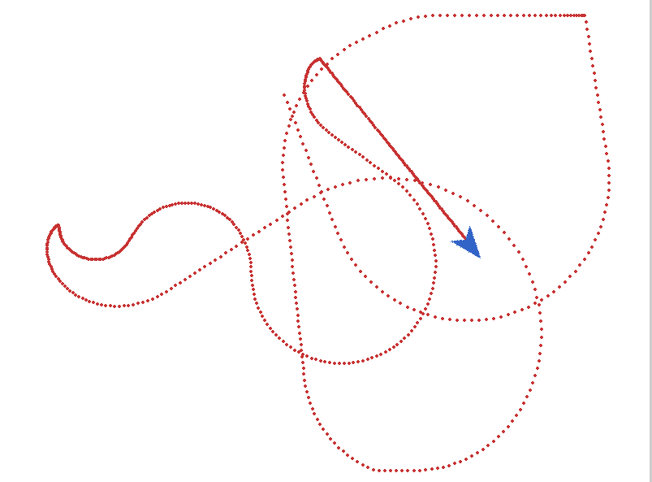

# Overview

This repo contains two test questions for the Layup Parts Senior Software Engineer position. 

## Setup

### Ensure you have Python installed on your machine. 

### To set the environment up, we will use a virtual environment and then install the requirements.

```
python -m venv venv
```

```
source venv/bin/activate
```

```
pip3 install -r requirements.txt
```


#### *** NOTE: If you need to set up the virtual environment package and assuming you are working with WSL or Linux, you can run the following command to install the requirements:

```
sudo apt install python3-venv
```

## Question 1: Running the Airplane Simulator

### Controls

The user can control the plane using the following controls:

- Left Arrow Key: Turn yaw counterclockwise
- Right Arrow Key: Turn yaw clockwise
- Up Arrow Key: Increase speed
- Down Arrow Key: Decrease speed
- Spacebar: Reset position & speed

### Running the Airplane Simulator

To run the airplane simulator, do the following:

```
python3 question1.py
```

### Report
The simulator use pygame to create the simulation environment. The bounds of the x and y axis are respected by the plane so that if it attempts to move outside of the bounds, it will be directed to the unrestricted tangent of the plane's current position. In the below image, the plane is the blue triangle and the red line is the trajectory of the plane. In the thicker portion of the red line, the plane is going slower and vise versa for faster. 



I could have added a GUI but I thought the controls would be more responsive with keys as the input method.

### Features

    - Smooth airplane movement
    - Visual trajectory tracking (red dots)
    - Border collision prevention
    - Speed control (0 to 10 units per frame)
    - 360-degree rotation
    - Reset button (spacebar)

## Question 2: Running the Sequence Calculator

For the sequence calculator, run:

```
python3 question2.py
```


## Question 2 Report

The next step in optimizing this code would be to add recursion. It was decided to not use recursion because python has a default recursion limit of 1000. This was a problem for the sequence calculator because the sequence grows exponentially. So, an iterative approach was used instead. 

*** Note: See sequence_log.txt for the output of the sequence calculator.